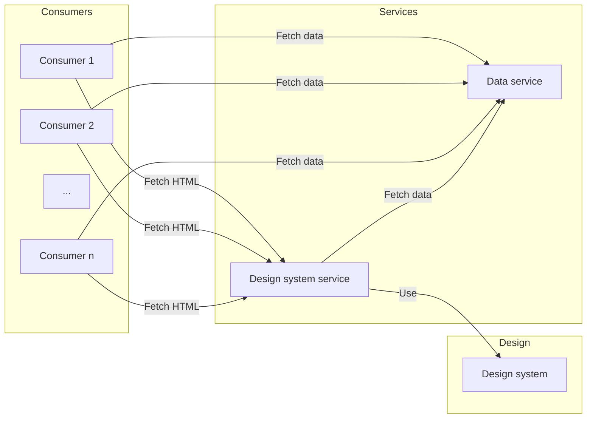
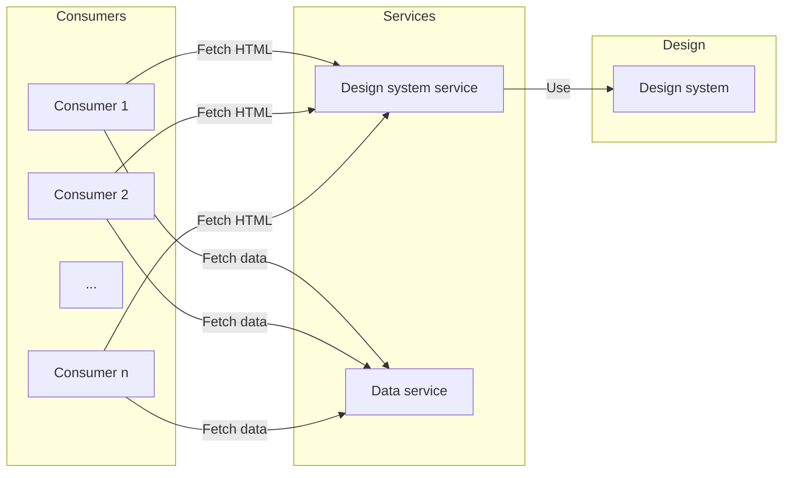
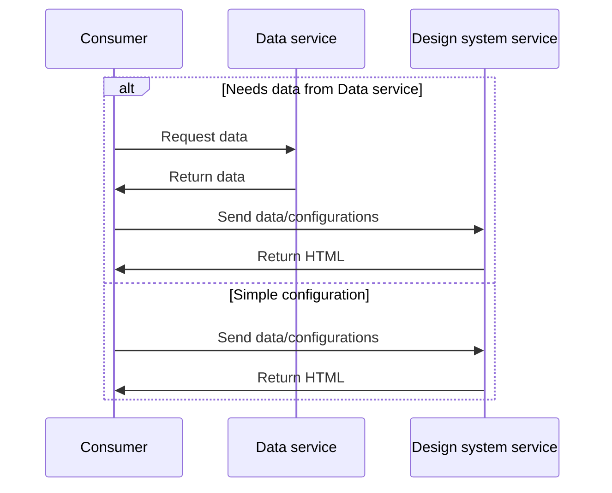
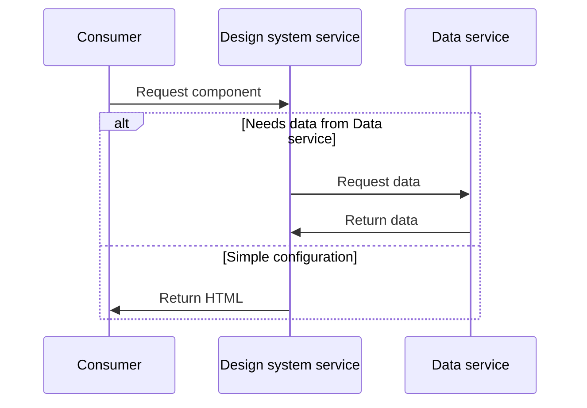

# Reimagined fishstick

```mermaid
graph LR
  subgraph Consumers
    A[Consumer 1]
    B[Consumer 2]
    C[...]
    D[Consumer n]
  end

  subgraph Services
    E[Design system service]
    F[Data service]
  end

  subgraph Design
    G[Design system]
  end

  A --> |"Fetch HTML"| E
  A --> |"Fetch data"| F
  B --> |"Fetch HTML"| E
  B --> |"Fetch data"| F
  D --> |"Fetch HTML"| E
  D --> |"Fetch data"| F

  E --> |"Use"| G
  E --> |"Fetch data"| F
```

```mermaid
graph LR
  subgraph Consumers
    A[Consumer 1]
    B[Consumer 2]
    C[...]
    D[Consumer n]
  end

  subgraph Services
    E[Design system service]
    F[Data service]
  end

  subgraph Design
    G[Design system]
  end

  A --> |"Fetch HTML"| E
  A --> |"Fetch data"| F
  B --> |"Fetch HTML"| E
  B --> |"Fetch data"| F
  D --> |"Fetch HTML"| E
  D --> |"Fetch data"| F

  E --> |"Use"| G
```

## How does it work?

```mermaid
sequenceDiagram
  participant C as Consumer
  participant DS as Data service
  participant DSS as Design system service
    alt Needs data from Data service
        C->>DS: Request data
        DS->>C: Return data
        C->>DSS: Send data/configurations
        DSS->>C: Return HTML
    else Simple configuration
        C->>DSS: Send data/configurations
        DSS->>C: Return HTML
    end
```

```mermaid
sequenceDiagram
  participant C as Consumer
  participant DSS as Design system service
  participant DS as Data service
    C->>DSS: Request component
    alt Needs data from Data service
        DSS->>DS: Request data
        DS->>DSS: Return data
    else Simple configuration
        DSS->>C: Return HTML
    end
```
