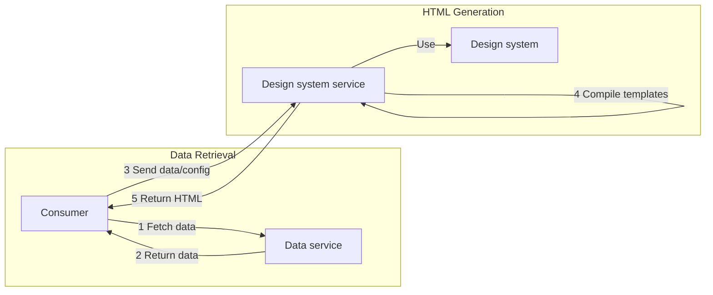
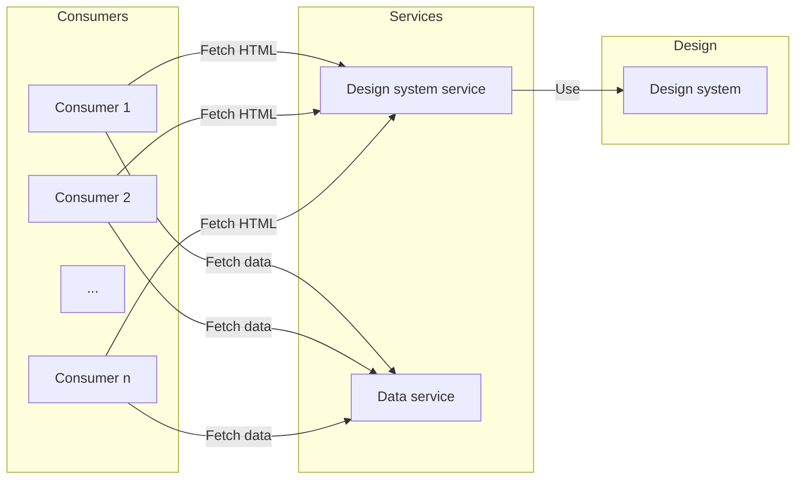
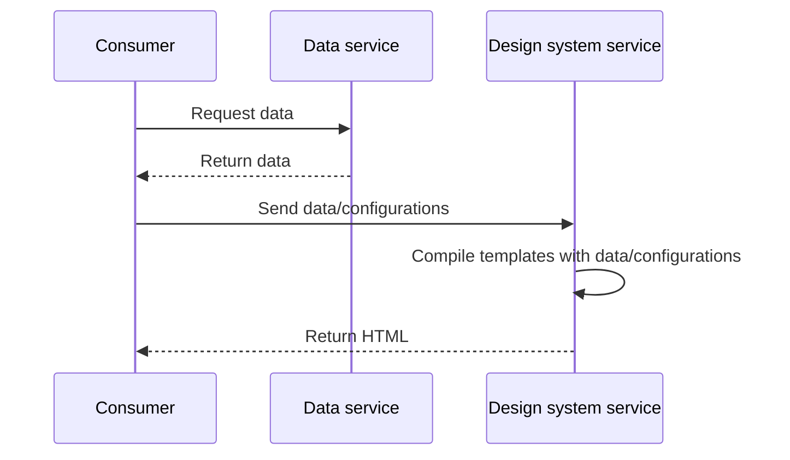

# Reimagined fishstick

## How does it work?

## TODO:

- scala missing handlebars so endpoint for teams that don't have feds
- version manager for transform changes or template changes
- manage multiple version of the template
