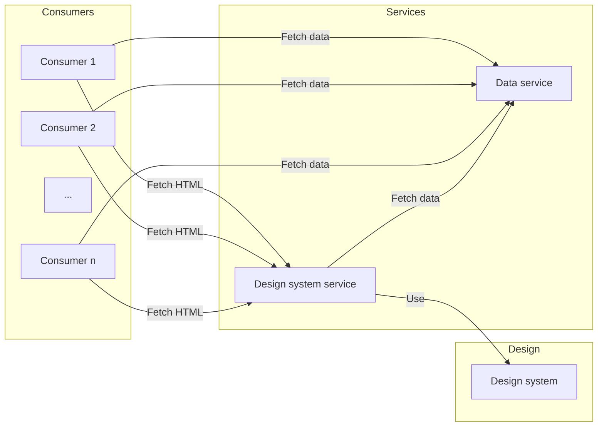

# Reimagined fishstick

```mermaid
graph LR
  subgraph Consumers
    A[Consumer 1]
    B[Consumer 2]
    C[...]
    D[Consumer n]
  end

  subgraph Services
    E[Design system service]
    F[Data service]
  end

  subgraph Design
    G[Design system]
  end

  A --> |"Fetch HTML"| E
  A --> |"Fetch data"| F
  B --> |"Fetch HTML"| E
  B --> |"Fetch data"| F
  D --> |"Fetch HTML"| E
  D --> |"Fetch data"| F

  E --> |"Use"| G
  E --> |"Fetch data"| F
```
